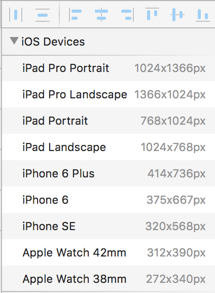
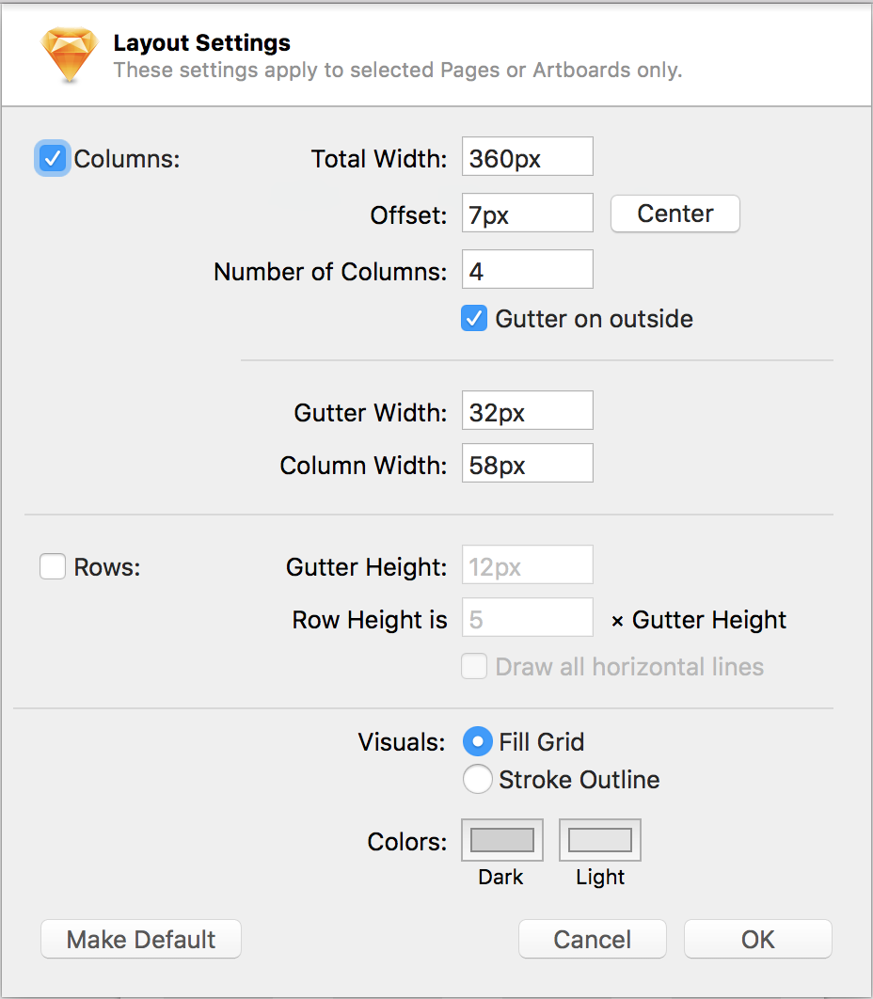
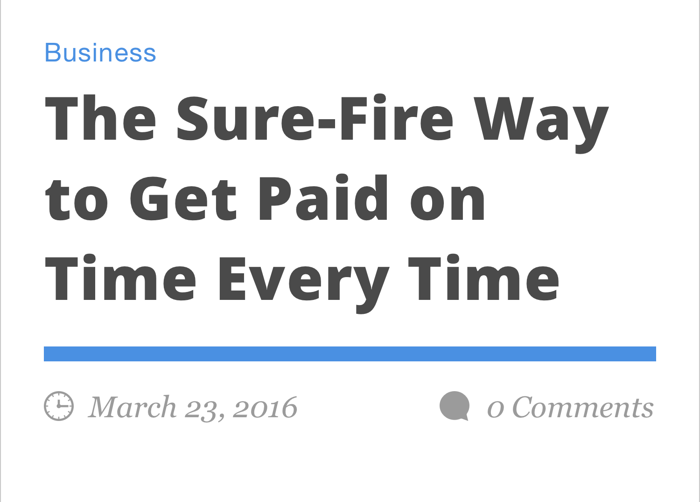
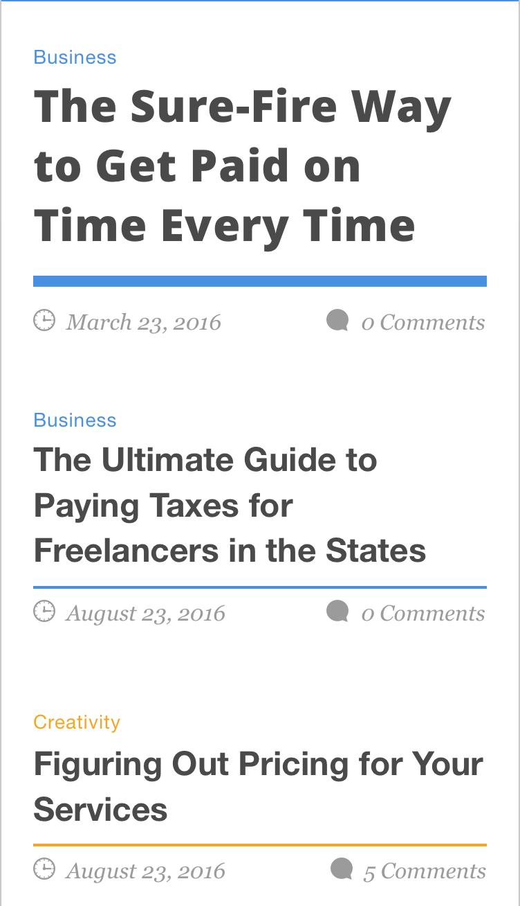

# Designing the Blog for Mobile

We'll start off with the featured blog post, then design the other posts, ending with a "load more" button.

## Artboard Setup
First, we need to create the artboard to design on. Press "A" to quickly open up the artboard menu, and select iOS Devices > iPhone 6. You'll notice that it's 675px wide, so descrease the size of the artboard to 674 so we have a nice, even number to work with.

Next, open up layout settings, and change the settings to the following:
 - Total Width: 360px
 - offset (press center)
 - Columns: 4
 - Check the gutter width on outside
 - Gutter Width: 32px
 - Allow Column Width to calculate itself
 

### Designing the Featured Blog Post
The featured post is bigger than any other blgo post and is supposed to grab the immediate attention of the visitor. This is very similar to the front page headline story you see on newspapers.

#### Category
We'll first create the category tag, in this case, it'll will be "business". 
To do this, press "T" and type "Business", change the size to 14px, line height of 16px, and a character of 0.5
Next, change the color to the base color of blue, and create this into a text-style called "Category/Business". This will allow you to quickly create new category tags in the future.

#### Headline
To create the headline, we'll create another text layer, and type in "The Sure-Fire Way to Get Paid on Time Every Time", and choose "Helvetica Neue" for the typeface, choose a font size of 32px, and a character spacing of 0.5, leaving the line height alone, and change the color to #4A4A4A (we'll be using this shade of gray for most of the text in our design). Then make sure to turn on the layout guide by pressing "ctrl + l" and size the headline within the cofines of the 4 columns. In this case, the width should be 328px. Space this 8px underneath the category tag. Next, create this into a shared text style called "H1-Mega/Mobile".

Alternatively, you can also use the Craft Plugin to create dummy content if you're not set on the exact headlines I'm using. Click on the Type (the bottom icon in Craft with a "T")and click Headlines > Technology.

#### Banner and Meta
To create the underlin banner, you simply need to create a rectangle by pressing "r", make it hte same blue as the color of the category, and change the height to 8px. Place this 16px under the headline. You can quickly measure dinstances by hovering over an object and pressing the Alt key.

To create the meta tags, we'll first need to copy/paste in two icons from the Ionicons folder, ion-clock, and ion-chatbubble. After you've imported them onto your artboard, change their dimensions to 16x16 pixels. Next, two text layers, one with a date (e.g. January 5, 2016), and the other with the number of comments your post would have (e.g. 0 Comments). Next, plave them next to each of the appropriate icons with a spacing of 8px each, and put them 16px underneath the underline banner.

Finally, selct thse elements, and group them by pressing "CMD + g", and press "Cm + R" to rename the group "featured-post"

This is what the end result should look like:

### Designing the Other Blog Posts
The other blog posts will be very similar to the featured blog post, but the headline size will 24xp, line height of 32px, and no character spacing. Use these setting and create a new text style called "H2". The underline banner should have a height of 2 px, and have a spacing of 8px on the top and bottom.

You can create multiple blog posts of thse, with different categories and headlines. Make sure you match the color of the underline banner with the corresponding category. For this mobile view, I'll limit it to 8 blog posts, not counting the featured post.

### Designing Load More Button
The load more button consists of two things: white text, and a blue rectangle with a drop shadow. For the white text, create a font size of 16px and create a text style of "H3/white-centered", for the button, create a rectangle using the base color of blue, and changed the height to 36px. Then, add a shadow of 4px with 0 blur, with a color of dark blue (hex: #3B73B4)\

