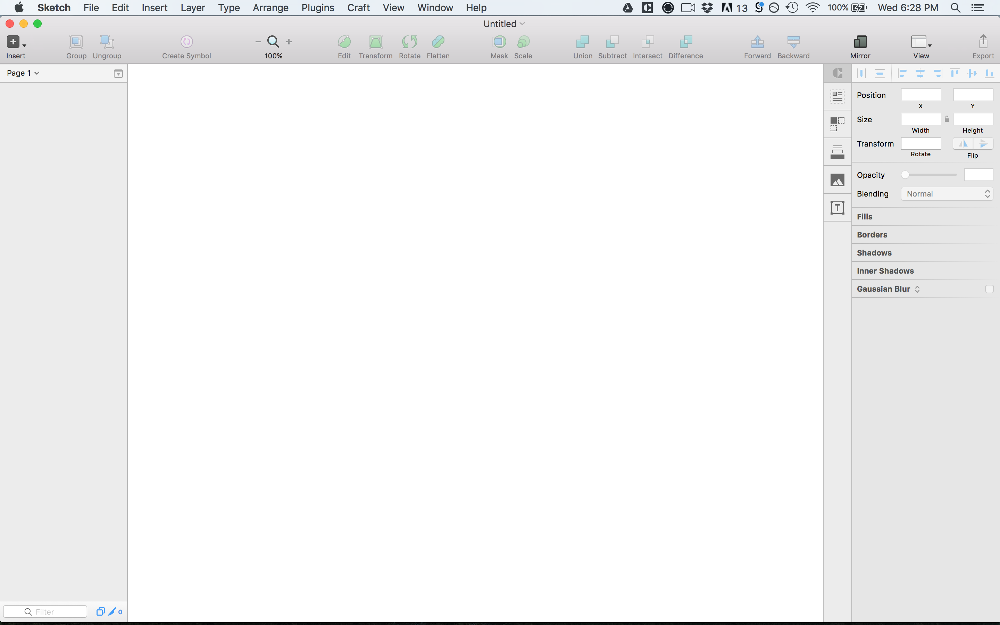
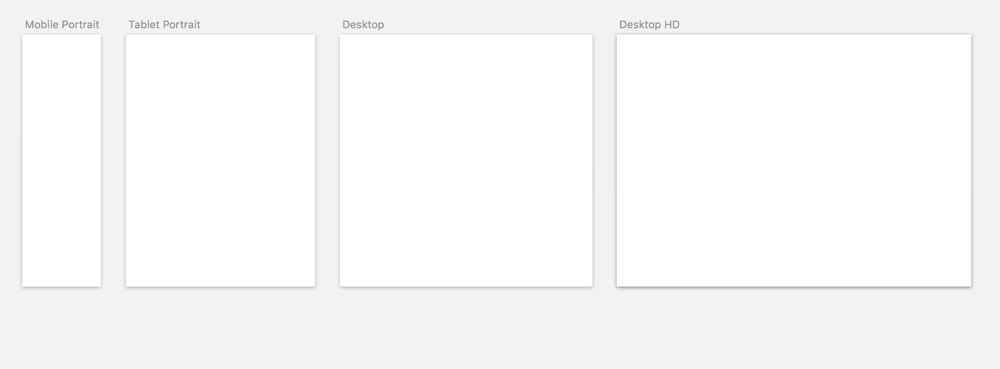
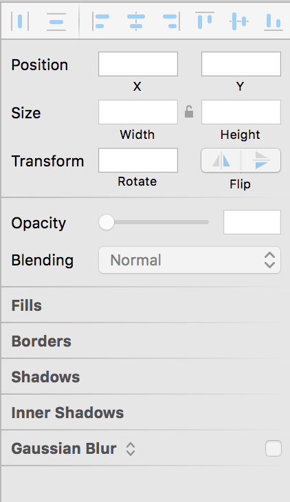
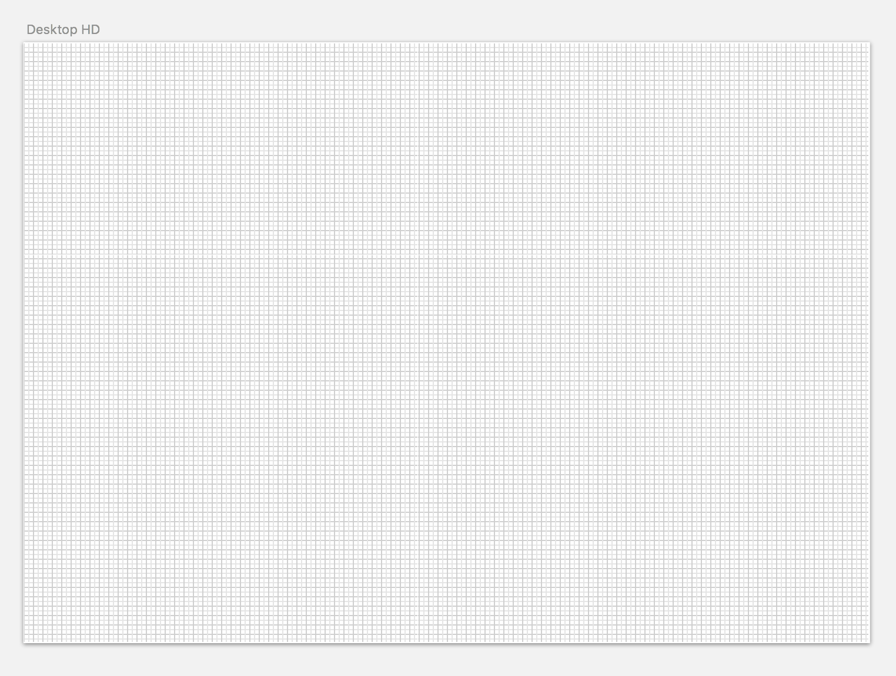
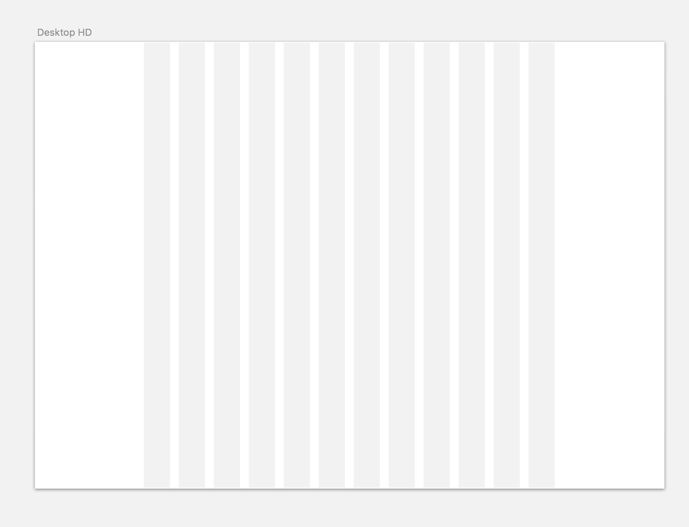

# Sketch Overview
A quick overview of Sketch 3, the UI software we’ll be using for this course.

## What is Sketch?
Sketch is an **amazing** Mac-Natvie User Interface Design Software. It was built from the ground-up with user interface design in mind. While you may have used other programs like Photoshop nad Illustrator, these programs with created for other uses and then have to be "hacked" to allow for effecient workflow when designing UIs. 

Sketch is very easy to learn. In fact, you can learn a big majority of it in this one video, and you'll be off in no time creating you own UIs. If you don't already have Sketch, you can go to https://www.sketchapp.com and get a free trial today!

### Getting Around
Sketch has a very user-friendly, intuitive interface. The bst way to get used to it is to play aaround with it and get a feel for all the features of the layouts: Inspector, Layers List, Toolbar.

### Artboards
Artboards are the canvases on which you can crete your 

### Pages
Pages are useful for creating different pages on your website, styleboards, etc. 

### Inspector Tool
Inspector tool is one of the best things about Sketch. Here is where you;ll find tools that allow you to chagnes things like position, size, opacity, and blending mode. It also includes tools like shared style manager, shadow managers, and much more.

### Grids & Layouts
A great improvement of Sketch over Photoshop for UI design is that Sketch includes a layout tool that allows you to quickly create layout columns and grids for visually appealing design.

### Plugins
Plugins allow you to extend the capabilities of Sketch with things like, measuring anntations, creating dummy content, and even prototyping. 
